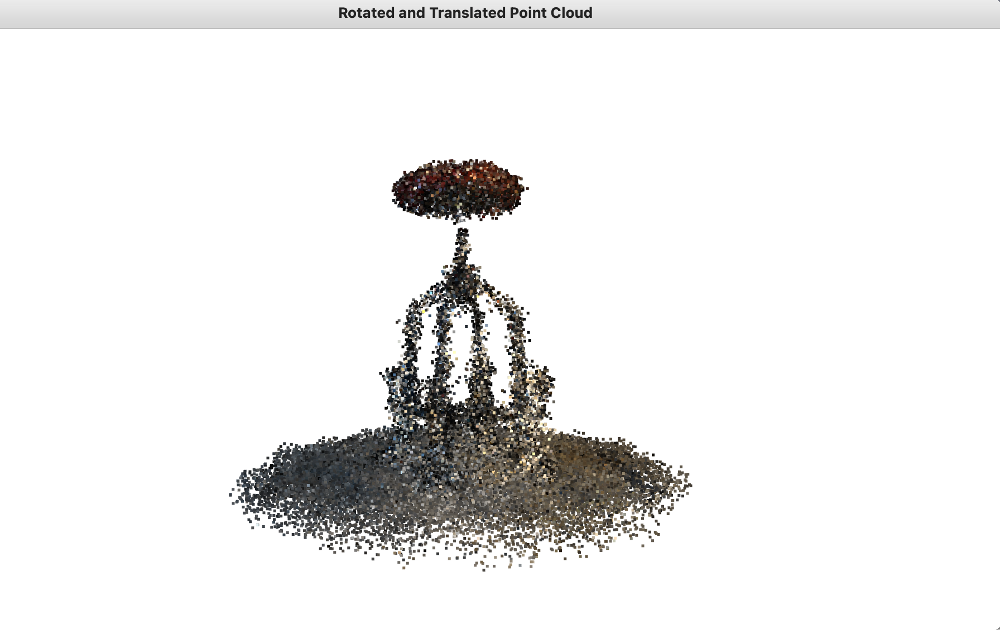
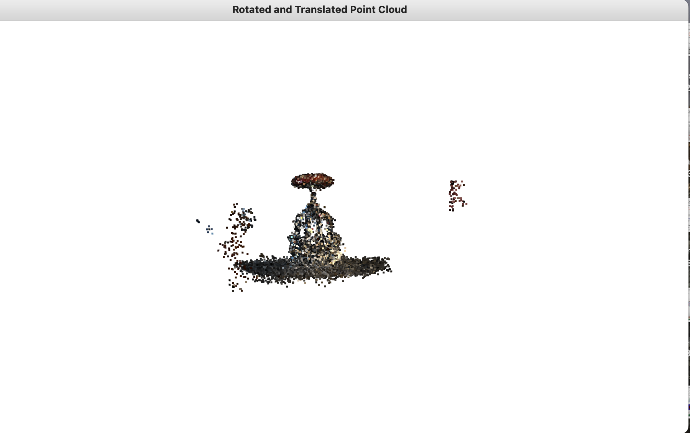
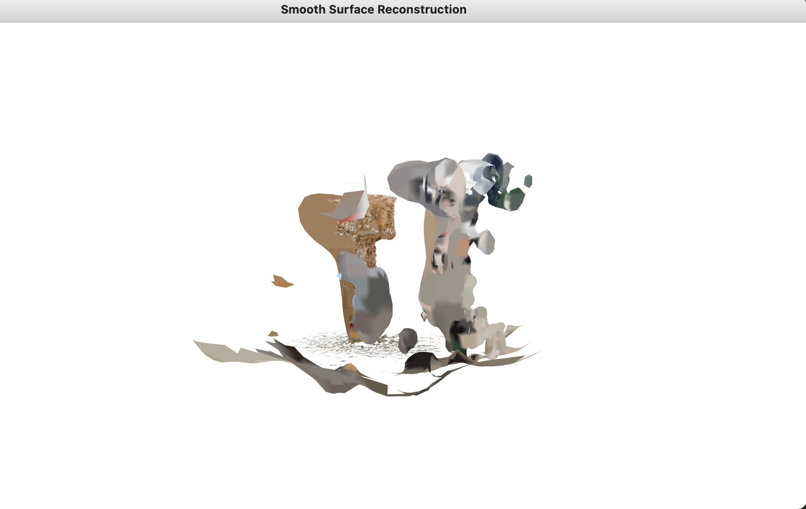
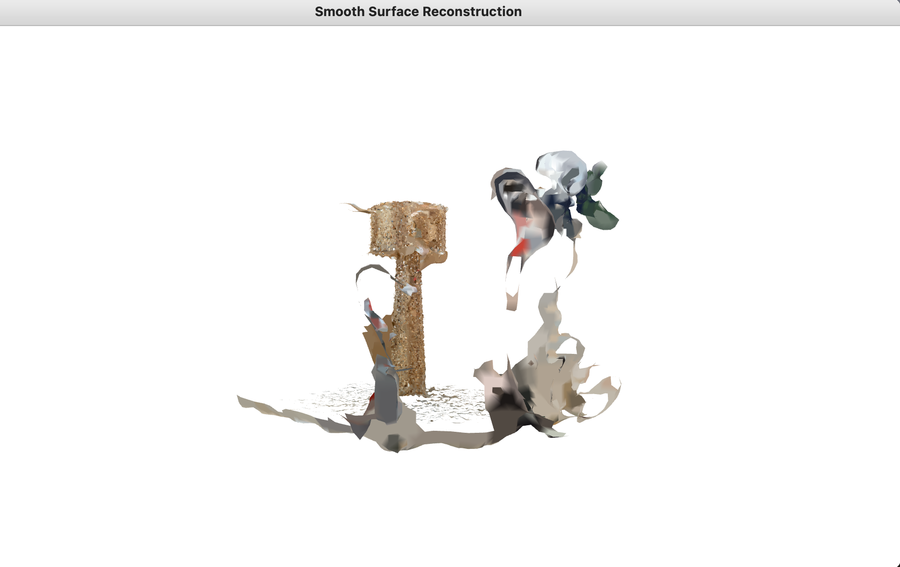
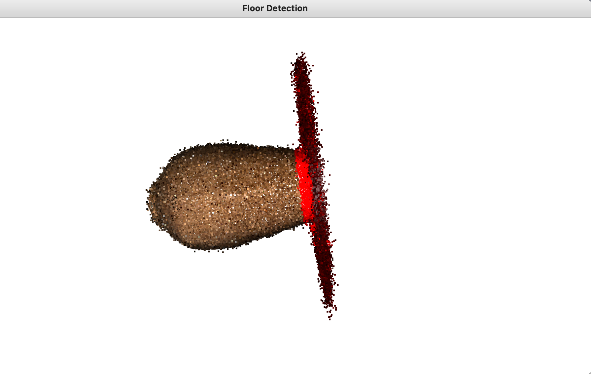
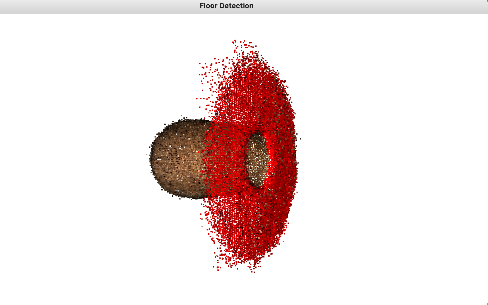
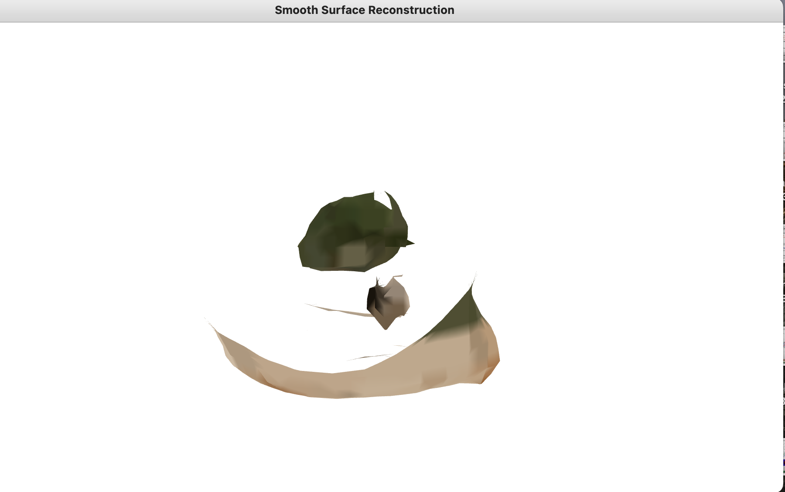
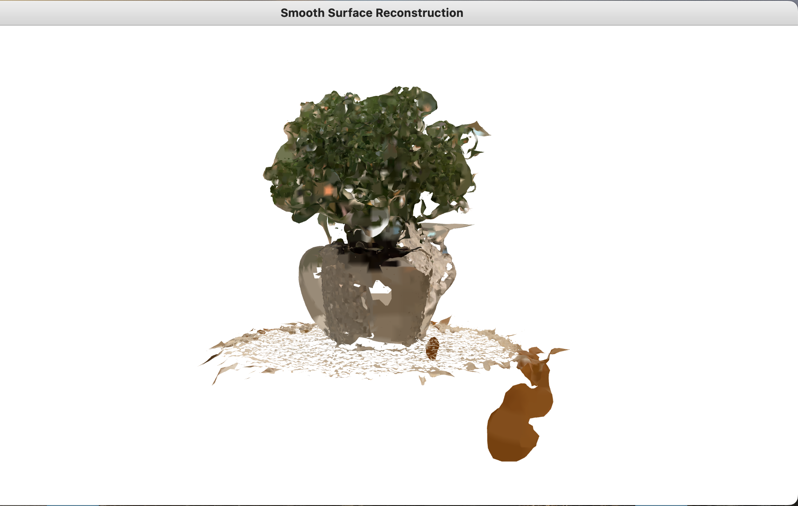
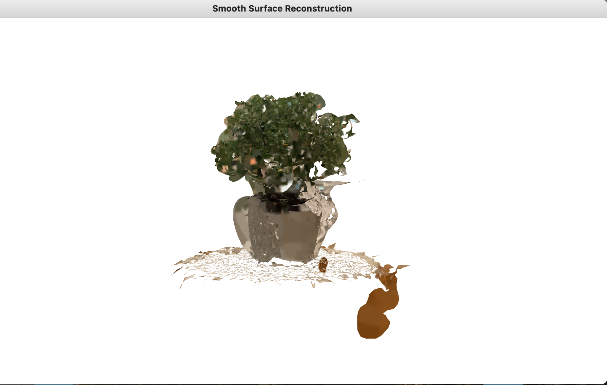

# floor_detection
Detect the floor in the point cloud re-orient it and perform surface reconstruction on the transformed point cloud

## Installation

pip install open3d numpy

## Usage
##### To detect floor and re-orient the floor and perform surface reconstruction on each of 10 point clouds
    python detect_floor.py

##### To run the unit test case:
    python -m unittest unit_testcase.py

## Detailed Approach

I broke down the problem statement into the following parts:

1. Detect the floor in any given point cloud
2. Translate the center of the floor to lie on the origin
3. Re-orient the floor to YZ plane such that normal is [1, 0, 0] (will also result in point cloud rotation)
4. Run the surface reconstruction algorithm for a smoother scene representation compared to point cloud.
5. Run the unit test to check the correctness of the above method.

###### Preprocessing the point cloud:
1. Downsample the point cloud for faster algorithmic execution.
2. Now remove the outliers so our next steps are more accurate.

###### Detecting the floor by using plane segmentation:
1. We can find the floor/planar region by randomly sampling points from the point cloud and trying to fit a plane and repeat this process for n_iteraions. (segment_plane function is used for this)
2. We also calculate the normal for each point in the point cloud to aid in determining the orientation of the plane. (internally used in segment_plane function)
3. Visually verify the detected floor plane

###### Translate the point cloud such that the center of the floor lies on the origin:
1. Compute the centroid of the detected floor plane
2. Translate the point cloud to bring the centroid to the origin

###### Re-orient the floor such that the equation of floor is y=0
1. Calculate rotation from Rodrigues's formula by figuring out the angle and axis of rotation
2. we get normal from the detected plane and the target normal is [0, -1, 0] based on our requirement that the equation of floor has to be y=0 and objects have to be in commonsense pose.
3. Calculate the angle from the dot product of both vectors and the axis from the cross product.
4. From the above we get the rotation matrix and we rotate the point cloud and center it at (0, 0, 0)

###### Surface reconstruction
1. For a more smoother and continuous representation of the scene we perform Poisson Surface Reconstruction.

###### Unit Testcase
1. Create a random transformation matrix and apply that transformation to the original point cloud.
2. Verify if the normals after applying the detect_floor_and_re_orient_pcd function on the original point cloud are the same as that of the randomly transformed point cloud.

## Results
* Shoe2 original pcd
  

* Shoe2 pcd with floor detected and represented in red
  

* Shoe2 re-oriented and centered at origin pcd

* Shoe2 poisson surface reconstruction

## Observations on what can be improved

1. we can play around with parameters of the outlier detection algorithm for more clearer point cloud. This should vary depending on the scene.
2. I have observered in few scenes like chair, lamp, plant by decreasing the std_ratio we are able to get a less noisy point clould and surface reconstruction.

  Stool after re-oriented with std_ratio=0.5

  

  Stool after re-oriented with std_ratio=2

  

3. Similar improvement has been observed by increasing the number of neighbours.

  Stool after surface reconstruction with nb_neighbours=5 in remove_statistical_outlier function

  

  Stool after re-oriented with nb_neighbours100 in remove_statistical_outlier function

  

4. For more accurate plane detection we can play around with distance_threshold and ransac_n parameters
5. I have observed that if I reduce the distance_threshold I was able to get more precise floor plane detection

  Vase floor detection with distance_threshold=0.05

  

  Vase floor detection with distance_threshold=0.02

  

6. We an also increase depth parameter of surface reconstrcution to algo for more detailed surface reconstrcution.

  plant surface renconstruction with depth=4

  

  plant surface reconstruction with depth=9

  

7. we can also increase the density_threshold to clean up the mesh.

  plant surface renconstruction with density_threshold=0.09

  

  plant surface renconstruction with density_threshold=0.01
    
  

  plant surface renconstruction with density_threshold=0
 
  

